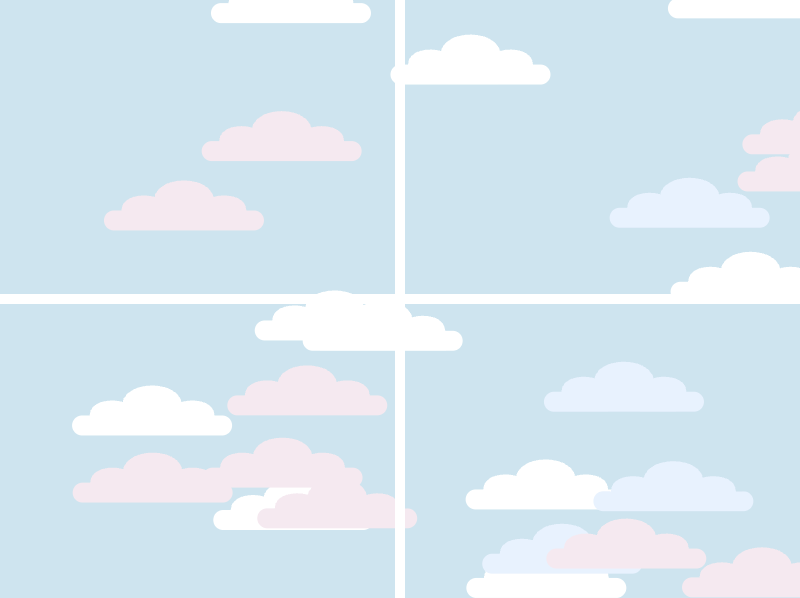

# Window View

**A1A** · Interactive Media, UTS · 6–21 August 2026

A pale sky seen through a window frame. Every reload reshuffles the clouds, so the same
sketch never draws the same sky twice.


## Concept

A still composition built entirely from `line()` and `ellipse()` — no images, no gradients.
The window frame is drawn as straight lines radiating from the centre of the canvas, which
turns the sky into a set of panes. Clouds are scattered at random positions in three colour
layers, so the pale ones read as distant and the bright ones as near.

The sketch calls `noLoop()` after one pass: it is a generative still, not an animation.
The variation lives in the reload, not in time.

## Inspiration

> _To fill in — there is no inspiration note in `sketch.js` for this one._

## How it works

- **`drawFrames(numSectors)`** — walks `numSectors` evenly-spaced angles around the circle
  and draws a thick white line from the centre outward for each. Four sectors give a cross;
  eight give a starburst.
- **`randomClouds(number, color)`** — each cloud is one thick horizontal line plus three
  ellipses sitting on top of it. Called three times with three different colours so the
  clouds stack into depth layers.
- **`noLoop()`** — freezes the frame once drawn.

## Versions

Two variants, made by changing the number of frame lines and the cloud palette.

| Version 1 — starburst frame, warm sky | Version 2 — cross frame, cool sky |
| --- | --- |
|  |  |
| Eight radiating lines; clouds in white, blush and pale yellow. | A simple cross splitting the sky into four panes; clouds in white, blush and pale blue. |

To switch, change the argument to `drawFrames()` in `draw()` and the three colours passed
to `randomClouds()`.

## Demo

No screen recording for this piece — it is a static sketch, so the stills above are the work.

## Run it

Open `index.html` in a browser, or serve the folder:

```bash
python3 -m http.server 8000
```

## Built with

p5.js 2.x (`js/p5.min.js`), plain HTML/CSS. Canvas is a fixed 800 × 600.
