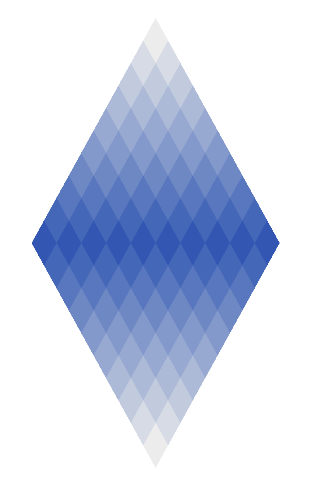

# Diamond

**A1B** · Interactive Media, UTS · 22 August – 3 September 2026

A large diamond built from nineteen rows of small diamonds. Click anywhere and light ripples
out through the tiles, each one flashing as the wave reaches it — the whole stone catching
the light for a moment, the way a cut gem does when it turns.

**▶ [Run it live](https://miyalee.github.io/p5-sketchbook/A1B_Diamond/)**


## Concept

One shape, repeated, is enough to make a second shape. Small diamonds stacked in a
symmetrical pyramid (1, 2, 3 … 10 … 3, 2, 1 per row) resolve into a single large diamond,
and because each row is tinted by its distance from the centre, the form reads as lit from
within.

The interaction is deliberately restrained: no colour change, no sound, no persistence.
A click is a pebble in water — a ripple travels out, passes through, and the surface
settles back exactly as it was.

## Inspiration

Precious stones, and the particular kind of opulence they carry — a cut gem under a
spotlight, throwing light back at you in bursts as it turns. I wanted the sketch to have
that glitter: not a smooth animation, but a surface that catches and flashes.

## How it works

**Building the tower** — `createTower()` computes `layers * 2 - 1` rows. Each row gets its
colour from `lerpColor(bottomColor, topColor, distanceFromCentre)`, so the middle row is
fully saturated and the tips fade to near-white. Rows overlap by half a diamond height, so
the tiles interlock instead of stacking.

**The ripple** — every click pushes a `Ripple` onto a list. A ripple tracks only how many
frames it has lived; its radius is `framesMoved × speed`. Each frame, every `Diamond` asks
every live ripple `getBrightness(x, y)` — how close am I to your wave front? — takes the
highest answer, and lerps its own colour that far toward white.

That split matters: the ripple never touches the diamonds, and the diamonds never store
state. Ripples are deleted once they expire, and the tower is unchanged.

**Switching versions** — `keyPressed()` sets `version` from the `1` / `2` key and calls
`buildTower()`, which empties `diamonds` and rebuilds the tower in that version's colour.

## Configuration

Everything tunable sits in one `CONFIG` object at the top of `sketch.js`:

| Key | Default | Effect |
| --- | --- | --- |
| `layers` | `10` | Rows before mirroring — 10 layers gives 19 rows |
| `diamondWidth` / `diamondHeight` | `32` / `58` | Tile proportions |
| `topColor` | `#ececec` | Colour at the two tips |
| `version1Color` / `version2Color` | `#be2d69` / `#2457B8` | Colour at the widest row, per version |

Ripple behaviour lives in the `Ripple` constructor: `speed` 8 px/frame, `width` 40 px,
`framesDuration` 120 frames (≈2 s).

## Versions

Two variants, differing only in the colour at the widest row. **Press `1` or `2`** to
switch.

| Version 1 — `#be2d69` | Version 2 — `#2457B8` |
| --- | --- |
|  |  |

An early paper study is in [`media/scratch.png`](media/scratch.png).

## Run it

Serve the repo from its root, then pick this project:

```bash
npx http-server -p 8000
```

## Built with

p5.js 2.x (`js/p5.js`), plain HTML/CSS. Canvas fills the window.
