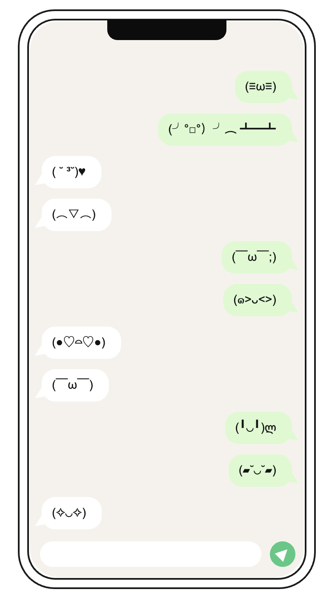

# Communication

**A1C** · Interactive Media, UTS · 2–4 September 2026

A phone with no keyboard. Tap the left half of the screen and someone says something; tap
the right half and you answer. Neither of you chooses the words.

**▶ [Run it live](https://miyalee.github.io/p5-sketchbook/A1C_Communication/)**


## Concept

A messaging thread stripped down to its two real inputs: *which side is speaking*, and
*something got sent*. The content is drawn at random from a list of faces, so the
conversation has rhythm, turn-taking and tone — but no meaning you control.

Two behaviours drive the piece, and they map onto the brief:

- **Conditional** — which side of the phone you tap decides which side the bubble lands on.
  Left taps make white bubbles on the left; right taps make green bubbles on the right.
- **Unpredictable** — the text is `random()`-picked from a predefined list, so you never
  know what you are about to say.

## Inspiration

The easy, happy chats with friends that do not need to mean anything — the ones where you
are mostly sending faces back and forth, nobody is trying to make a point, and the whole
thing is warm precisely because it is light. The words were never carrying the message.

## How it works

- **`setupPhoneLayout()`** computes three rectangles once — the phone body, the chat area
  and the input bar — and stores them as `phoneBounds`, `chatBounds`, `inputBounds`. Every
  later hit-test and draw call reads from these, so the layout stays in one place.
- **`mousePressed()`** checks the click against the chat area, works out `side` from
  whether the x position falls left or right of the phone's midline, then pushes
  `{ side, text, fontsize }` onto the `messages` array.
- **`keyPressed()`** — `1` and `2` set `version` and clear `messages`, so each version
  starts from an empty chat.
- **Drawing** walks `messages` from the bottom of the chat area upward, so new messages
  push older ones off the top of the screen the way a real thread does.
- The phone frame, notch, bubbles with their tails, and the send button are all drawn as
  primitives — no image assets.

## Versions

Two variants, differing in the message set and the font size. **Press `1` or `2`** to
switch — the chat is cleared on each switch.

| Version 1 — kaomoji | Version 2 — emoji |
| --- | --- |
|  |  |
| `(≧▽≦)` `(╯°□°）╯︵ ┻━┻` — text-built faces at 14 px. Reads as older internet, more effortful, more personal. | Unicode emoji at 22 px. Reads as current, flatter, more disposable. |

Both message sets live in `js/messages.js` as `KAOMOJI_TEXTS` and `EMOJI_TEXTS`.

## Run it

Serve the repo from its root, then pick this project:

```bash
npx http-server -p 8000
```

## Built with

p5.js 2.x (`js/p5.min.js`), plain HTML/CSS. Canvas fills the window; the phone is a fixed
350 × 680 centred inside it.
