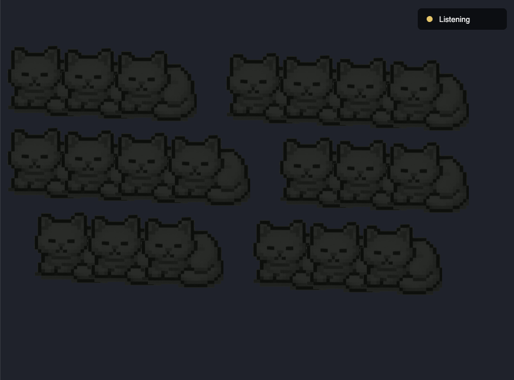

# Cats in the Dark

**A1E** · Interactive Media, UTS · 15–18 September 2026

Twenty cats asleep in a dark room. Speak, and one by one their eyes open. Stop, and one by
one they go back to sleep.

**▶ [Run it live](https://miyalee.github.io/p5-sketchbook/A1E_CatsInTheDark/)** — needs
microphone access.


## Concept

A room you can wake up by being in it. The piece listens through the microphone, and the
longer you keep talking the more of the room notices you — eyes opening in a slow, uneven
spread across the six huddles of cats until the whole dark floor is looking back.

The important design decision is that **duration wakes the cats, not volume.** A shout does
not wake them all at once; it just starts the count. The room responds to sustained
presence, which makes the interaction feel less like triggering a switch and more like
being noticed by something.

## Inspiration

A short video of a roomful of cats woken all at once in the dark — the shock of it was all
those eyes catching the light at the same moment, like little lasers coming on across the
floor. That image is the whole piece.

Built on the **Audio-Sensitive Animation** example from class.

## How it works

**One number runs the whole room.** `awakeRate` is a single float between 0 and 1 meaning
*what fraction of cats are awake*. Each frame:

```js
level > WAKE_LEVEL ? awakeRate += WAKE_SPEED : awakeRate -= SLEEP_SPEED
```

Every cat is assigned a fixed `wakeupOrder = random()` at startup, and `isAwake(cat)` is
just `cat.wakeupOrder < awakeRate`. Because the thresholds are random but fixed, the cats
always wake in the same scattered order rather than in rows — and they fall asleep in exact
reverse.

| Constant | Value | Meaning |
| --- | --- | --- |
| `WAKE_LEVEL` | `0.04` | Mic level above which waking starts |
| `WAKE_SPEED` | `0.01` | ≈1 cat per 0.06 s of continuous sound |
| `SLEEP_SPEED` | `0.005` | Falling asleep takes twice as long as waking |

**Audio.** p5.sound's microphone path does not work under p5 2.x, so the sketch goes
straight to the Web Audio API: `getUserMedia` → `AnalyserNode` (`fftSize` 1024) → RMS over
the time-domain samples in `micLevel()`. A **Listening / Stopped** button in the top-right
lets you release the mic.

## Versions

| Version 1 — asleep | Version 2 — woken |
| --- | --- |
|  |  |
| The resting state. `awakeRate` at 0, the room silent. | Mid-wake, roughly half the room. Yellow eye reflections are the only light in the scene. |

## Run it

Serve the repo from its root, then pick this project:

```bash
npx http-server -p 8000
```

It must be served, not opened as a file — `getUserMedia` will not hand over the microphone
to a `file://` page, so the cats never wake up. `http://localhost` counts as a secure
context, so the command above is enough.

## Built with

p5.js 2.x (`js/p5.js`) for rendering, Web Audio API directly for the microphone.
Sprites in `assets/` (`cat-sleep.png`, `cat-open-eyes.png`). Background `#1E222C`.
