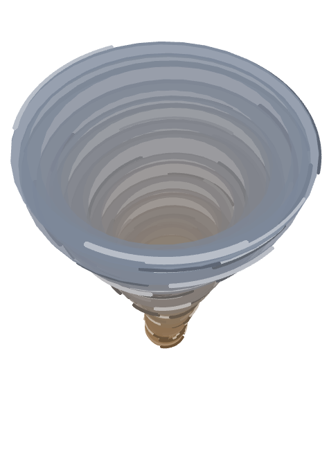

# Tornado

**A1F** · Interactive Media, UTS · 30 September – 3 October 2026

A cartoon tornado in 3D, built from thirty stacked rings that spin, swell and sway. Drag to
walk around it, and use the panel in the corner to reshape it while it runs.

**▶ [Run it live](https://miyalee.github.io/p5-sketchbook/A1F_Tornado/)**


## Concept

A storm you can hold still and look at from any side. The tornado is never the same shape
twice — each ring breathes in and out, the tail whips around, and the whole funnel drifts
slowly across the ground — but it always reads as one body, because neighbouring rings move
together.

The colour runs from earth brown at the tip to storm grey at the top, as if the funnel is
pulling the ground up into the cloud.

## Inspiration

Two exercises from the book **Code as Creative Medium**: **Spiral**, for the rings turning
around a shared axis, and **Circle Morphing**, for circles whose size keeps shifting. The
tornado puts the two together — a stack of morphing circles, each one spinning.

## How it works

**`setup()`** — builds thirty rings from the ground up. Each ring stores its height, a random
tube thickness, a spin multiplier, and six streaks. The streaks are short arcs drawn once
with `buildGeometry()` and reused every frame, which keeps the line drawing fast in WEBGL.

**Shape.** Each frame, a ring's radius is `lerp(30, 260, pow(heightRatio, finesse))`. With
`finesse` at 4 the lower rings stay narrow and the top flares out into a funnel; at 1 it
becomes a straight cone. `noise()` then swells each radius by up to ±30% at the tip and ±10%
at the top. Neighbouring rings sample nearby noise values, so the outline stays smooth.

**Sway and drift.** Rings sway sideways on their own noise paths, up to 70 px at the tip and
10 px at the top. The whole tornado also drifts up to 100 px across the ground.

**Spin.** The spin follows a 20-second cycle: slow at 1 rad/s, ease up over 6 s, hold at
2 rad/s for 5 s, ease back down. The easing is `(1 - cos(PI * amount)) / 2`. The angle is
accumulated with `deltaTime`, so a speed change never jumps the rings. The tip spins twice as
fast as the top, which twists the column.

**Tilt.** Rings tilt by `-10 * sin(PI * heightRatio)` degrees — flat at both ends, leaning
most in the middle.

**Look.** Rings are flat `torus()` shapes at 80% opacity with no lighting, so overlaps build
up soft bands of colour. Half the streaks are 45% lighter than their ring and half are 25%
darker, giving the hand-drawn swirl.

**Panel.** A [lil-gui](https://lil-gui.georgealways.com/) panel controls finesse, both
colours, fast spin speed and duration, drift, and sway. Radius and colour are worked out in
`draw()` rather than stored, so every slider takes effect immediately without rebuilding the
rings. While a slider is being dragged, `orbitControl()` is paused so the camera stays put.

## Views

A1F has a single version. In place of a `1` / `2` switch it ships the live control panel,
so the variants are yours to make.

| Side view | From above |
| --- | --- |
|  |  |
| The default angle. Brown tip, grey funnel, the column bending as each ring sways. | Dragged overhead. The rings stack into a whirlpool, with the brown tip at its centre. |

## Run it

Serve the repo from its root, then pick this project:

```bash
npx http-server -p 8000
```

Drag to orbit, scroll to zoom.

## Built with

p5.js 2.x (`js/p5.min.js`) in WEBGL mode, plus lil-gui 0.21 (`js/lil-gui.umd.min.js`) for
the control panel. Canvas fills the window.
