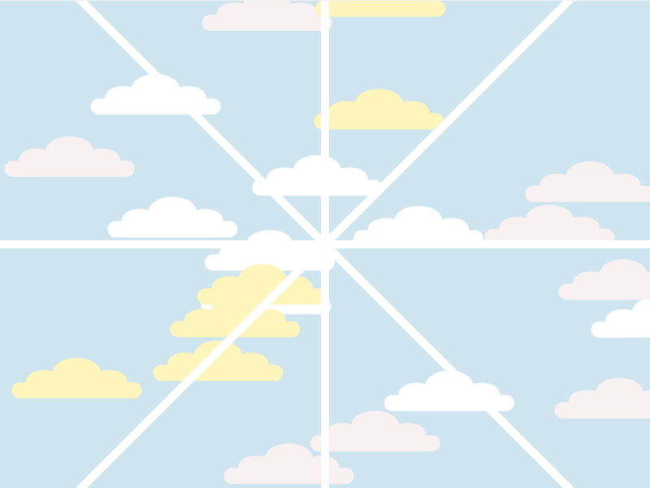
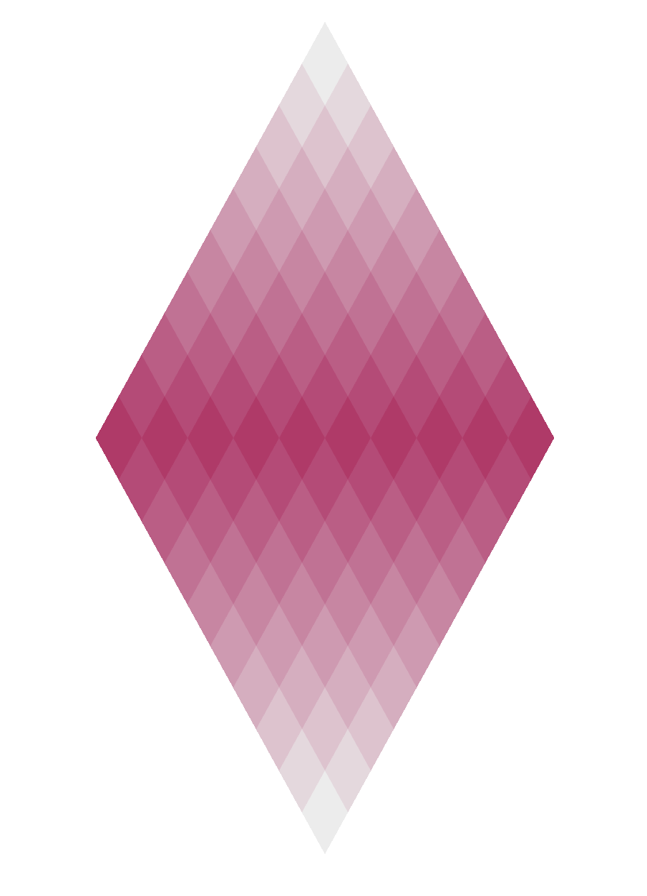
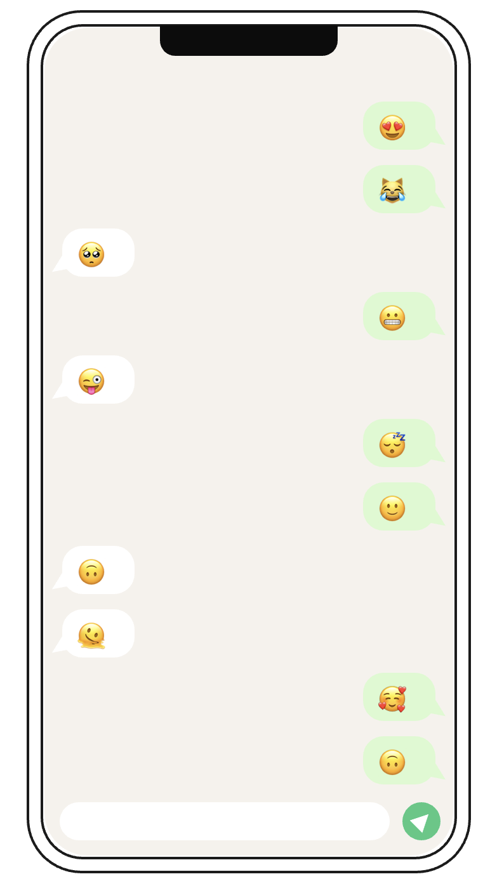
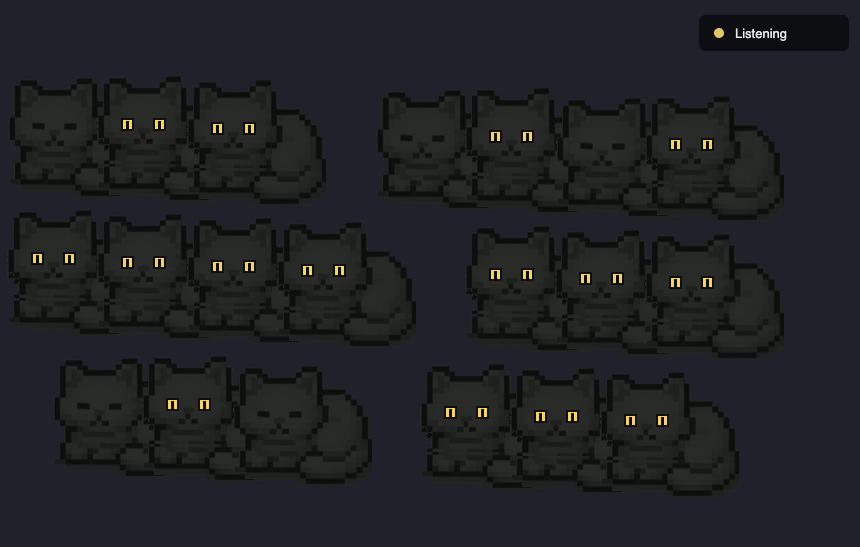

# Interactive Media — A1 Sketch Series

Five p5.js sketches made for **Interactive Media** at **UTS**, August–September 2026.
Each one takes a single interaction — a reload, a click, a tap, a drag, a voice — and
builds a small world that responds to only that.

Every project is self-contained: open its `index.html` and it runs. Each folder has its own
README with the concept, the inspiration, how the code works, and a demo recording.

---

## The works

| | |
| --- | --- |
|  | ### [A1A — Window View](A1A_WindowView/)<br>**6–21 Aug 2026** · *reload*<br><br>A pale sky seen through a window frame, drawn only from lines and ellipses. `noLoop()` freezes it after one pass, so the variation lives in the reload — every refresh scatters a new sky. |
|  | ### [A1B — Diamond](A1B_Diamond/)<br>**22 Aug – 3 Sep 2026** · *click*<br><br>Nineteen rows of small diamonds resolve into one large diamond. Click and a ring of light sweeps outward from the cursor, bleaching each tile white as it passes, then leaves the surface exactly as it was. |
|  | ### [A1C — Communication](A1C_Communication/)<br>**2–4 Sep 2026** · *tap left / tap right*<br><br>A phone with no keyboard. Tap the left half and someone speaks; tap the right half and you answer. The words are drawn at random — what's left is the shape of a conversation without its content. |
|  | ### [A1D — Stroke Blooming](A1D_StrokeBlooming/)<br>**6–11 Sep 2026** · *drag*<br><br>A drawing tool that won't let you keep a line. Flowers open along the path you trace, hold for three seconds, then fade. The stroke is never rendered — only its residue. |
|  | ### [A1E — Cats in the Dark](A1E_CatsInTheDark/)<br>**15–18 Sep 2026** · *microphone*<br><br>Twenty cats asleep in a dark room. Speak and their eyes open one by one. Duration wakes them, not volume — the room responds to sustained presence rather than to a shout. |

---

## Running them

Most sketches open straight from the filesystem — double-click `index.html`.

**A1E needs a local server**, because `getUserMedia` refuses to run from a `file://` URL:

```bash
cd A1E_CatsInTheDark
python3 -m http.server 8000
# then open http://localhost:8000 and allow microphone access
```

The same command works for any of the others if you'd rather serve them all.

## Built with

[p5.js 2.x](https://p5js.org/), vendored into each project's `js/` folder so the sketches
run offline with no install step. A1D drops to raw Canvas 2D for its petal gradients;
A1E uses the Web Audio API directly, since p5.sound's microphone path is broken under p5 2.x.

No build tools, no dependencies, no package manager.

## Layout

```
A1X_ProjectName/
├── index.html      entry point
├── sketch.js       the work
├── css/style.css
├── js/             vendored p5.js (+ addons where used)
├── assets/         sprites, where the piece needs them
├── media/          version1.png, version2.png, demo.mp4
└── README.md       concept, inspiration, how it works
```

Each piece ships **two versions** — a colour, palette or content variant — documented side
by side in its README and switchable with a single constant at the top of `sketch.js`.
