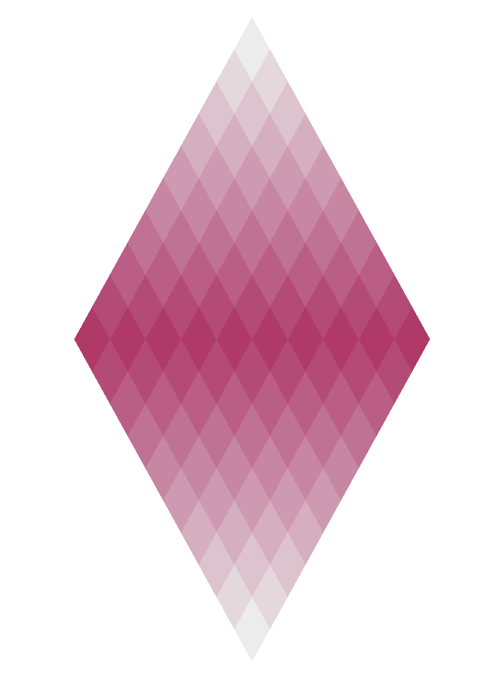
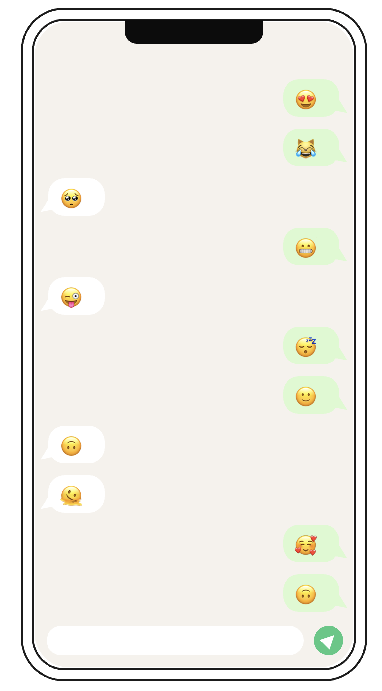
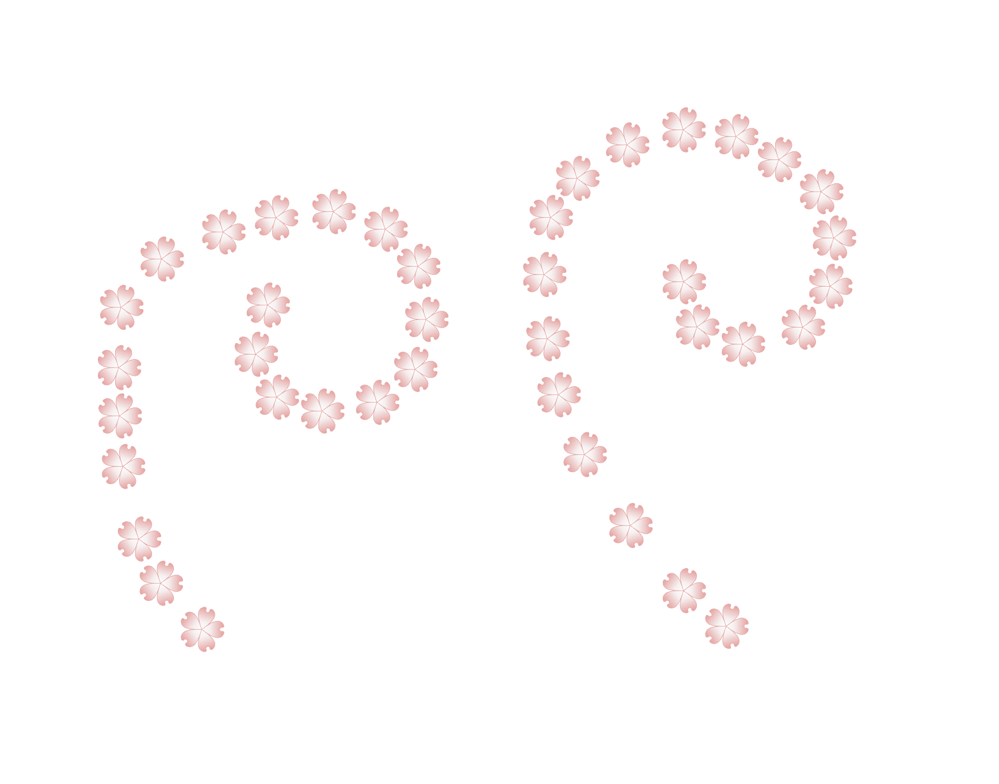
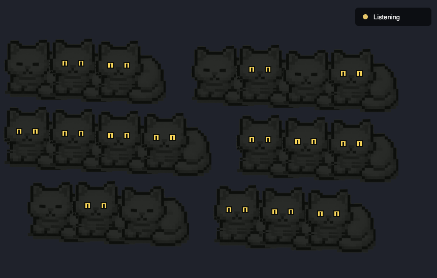
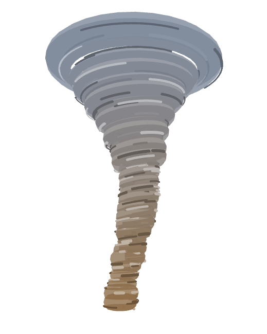

# Interactive Media — A1 Sketch Series

some p5.js sketches made for **Interactive Media** at **UTS**, August–October 2026.
Each one takes a single interaction: click, tap, drag, voice, etc.

### [View the code — github.com/miyalee/p5-sketchbook](https://github.com/miyalee/p5-sketchbook)

---

## The works

| | |
| --- | --- |
|  | **[A1A — Window View](https://github.com/miyalee/p5-sketchbook/tree/main/A1A_WindowView)** · [▶ Run live](https://miyalee.github.io/p5-sketchbook/A1A_WindowView/)<br>**6–21 Aug 2026** · *reload*<br><br>A pale sky seen through a window frame, drawn only from lines and ellipses. `noLoop()` freezes it after one pass, so the variation lives in the reload — every refresh scatters a new sky. |
|  | **[A1B — Diamond](https://github.com/miyalee/p5-sketchbook/tree/main/A1B_Diamond)** · [▶ Run live](https://miyalee.github.io/p5-sketchbook/A1B_Diamond/)<br>**22 Aug – 3 Sep 2026** · *click*<br><br>Nineteen rows of small diamonds resolve into one large diamond. Click and light ripples out through the tiles, each flashing as the wave reaches it — the whole stone catching the light the way a cut gem does when it turns. |
|  | **[A1C — Communication](https://github.com/miyalee/p5-sketchbook/tree/main/A1C_Communication)** · [▶ Run live](https://miyalee.github.io/p5-sketchbook/A1C_Communication/)<br>**2–4 Sep 2026** · *tap left / tap right*<br><br>A phone with no keyboard. Tap the left half and someone speaks; tap the right half and you answer. Neither of you chooses the words — it is the easy back-and-forth of a chat that never needed to mean anything. |
|  | **[A1D — Stroke Blooming](https://github.com/miyalee/p5-sketchbook/tree/main/A1D_StrokeBlooming)** · [▶ Run live](https://miyalee.github.io/p5-sketchbook/A1D_StrokeBlooming/)<br>**6–11 Sep 2026** · *drag*<br><br>A drawing tool that won't let you keep a line. Flowers open along the path you trace, hold for three seconds, then fade — the Chinese idiom 妙笔生花, "a wondrous brush grows flowers", taken at its word. |
|  | **[A1E — Cats in the Dark](https://github.com/miyalee/p5-sketchbook/tree/main/A1E_CatsInTheDark)** · [▶ Run live](https://miyalee.github.io/p5-sketchbook/A1E_CatsInTheDark/)<br>**15–18 Sep 2026** · *microphone*<br><br>Twenty cats asleep in a dark room. Speak and their eyes open one by one, like little lasers coming on across the floor. Duration wakes them, not volume — the room responds to sustained presence, not to a shout. |
|  | **[A1F — Tornado](https://github.com/miyalee/p5-sketchbook/tree/main/A1F_Tornado)** · [▶ Run live](https://miyalee.github.io/p5-sketchbook/A1F_Tornado/)<br>**30 Sep – 3 Oct 2026** · *drag · panel*<br><br>A cartoon tornado in 3D, thirty stacked rings that spin, swell and sway, fading from earth brown at the tip to storm grey at the top. Drag to walk around it; a live panel reshapes the tornado, its colours and its spin while it runs. |

---

## Running them

To run locally, serve the repo from its root:

```bash
npx http-server -p 8000
```

Then open <http://localhost:8000> .

## Built with

[p5.js 2.x](https://p5js.org/)

## Layout

```
A1X_ProjectName/
├── index.html      entry point
├── sketch.js       the work
├── css/style.css
├── js/             vendored p5.js (+ addons where used)
├── assets/         sprites, where the piece needs them
├── media/          version1.png, version2.png, demo.mp4
└── README.md       concept, inspiration, how it works
```
